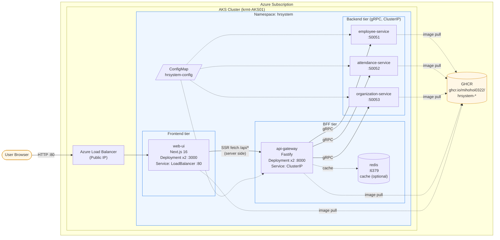

# my-AKS-playground-public

Azure Kubernetes Service (AKS) 学習用のフルスタック HR システムサンプル。
Next.js のフロントエンドから Node.js (Fastify) の API Gateway を介して、.NET 10 で実装した 3 つの gRPC マイクロサービスを呼び出す構成です。

---

## 1. アプリケーションの内容

HR (人事) 業務を題材にした疎結合マイクロサービスのデモアプリです。

### コンポーネント一覧

| # | コンポーネント | 役割 | 技術スタック | ポート |
|---|---|---|---|---|
| 1 | **web-ui** | 社員/出退勤/組織を閲覧する Web UI | Next.js 16 (App Router, standalone) | 3000 (HTTP) |
| 2 | **api-gateway** | ブラウザからの REST を gRPC に変換する BFF | Node.js 22 + Fastify | 8000 (HTTP) |
| 3 | **employee-service** | 社員マスタの CRUD | .NET 10 + gRPC | 50051 (gRPC) |
| 4 | **attendance-service** | 出退勤レコードの管理 | .NET 10 + gRPC | 50052 (gRPC) |
| 5 | **organization-service** | 部署・組織階層 | .NET 10 + gRPC | 50053 (gRPC) |
| 6 | **redis** | api-gateway のレスポンスキャッシュ | Redis 7 (Alpine) | 6379 (TCP) |

- リポジトリ構成
  - [src/packages/](src/packages) — Node.js ワークスペース (`web-ui` / `api-gateway` / `shared`)
  - [src/services/](src/services) — .NET ソリューション (3 gRPC サービス + Aspire AppHost + Tests)
  - [src/proto/](src/proto) — `buf` で生成する gRPC IDL (`hrsystem.employee/attendance/organization.v1`)
  - [k8s/](k8s) — AKS 用 Kubernetes マニフェスト (Kustomize)
  - [.github/workflows/build-and-push.yml](.github/workflows/build-and-push.yml) — GHCR へのマルチアーキ (linux/amd64 + linux/arm64) ビルド & プッシュ
  - [src/docker-compose.yml](src/docker-compose.yml) — ローカル動作確認用

### 動作モード

- **データストア**: `Cosmos:ConnectionString` が空のときは InMemory リポジトリで動作します (検証用)。本番では Azure Cosmos DB を接続。
- **Redis**: `REDIS_ENABLED=true` で api-gateway がキャッシュを使用。デフォルト `false`。

### コンテナイメージ

GitHub Actions により毎 push で GHCR に自動公開しています:

```
ghcr.io/mihohoi0322/hrsystem-web-ui:latest
ghcr.io/mihohoi0322/hrsystem-api-gateway:latest
ghcr.io/mihohoi0322/hrsystem-employee-service:latest
ghcr.io/mihohoi0322/hrsystem-attendance-service:latest
ghcr.io/mihohoi0322/hrsystem-organization-service:latest
```

tag は `latest` / `main` / `sha-<short>` の 3 種類。SBOM と SLSA provenance attestation 付き。

---

## 2. AKS での構成

シンプルさを優先し、Ingress / HPA / NetworkPolicy は **使いません**。
web-ui の Service を `type: LoadBalancer` にして Azure Load Balancer の Public IP を直接割り当て、ブラウザからアクセスします。

### 2.1 全体アーキテクチャ



### 2.2 Kubernetes リソース一覧

[k8s/](k8s) 配下を Kustomize で 1 コマンド適用します。

| ファイル | 主なリソース |
|---|---|
| [00-namespace.yaml](k8s/00-namespace.yaml) | Namespace `hrsystem` (Pod Security `restricted`) |
| [10-configmap.yaml](k8s/10-configmap.yaml) | 全サービス共通の環境変数 |
| [20-redis.yaml](k8s/20-redis.yaml) | Redis Deployment + Service (ephemeral) |
| [30..32-*-service.yaml](k8s/) | 3 gRPC サービスの Deployment + Service (ClusterIP) |
| [40-api-gateway.yaml](k8s/40-api-gateway.yaml) | BFF の Deployment + Service (ClusterIP) |
| [50-web-ui.yaml](k8s/50-web-ui.yaml) | Next.js の Deployment + Service (**LoadBalancer**, Public IP) |
| [kustomization.yaml](k8s/kustomization.yaml) | 上記を束ねるエントリポイント |

すべての Pod は以下のセキュリティ既定値を持ちます:

- `runAsNonRoot: true` / 各サービス固有の非 root UID
- `readOnlyRootFilesystem: true` (書き込みは `emptyDir` のみ)
- `allowPrivilegeEscalation: false`
- `capabilities.drop: [ALL]`
- `seccompProfile: RuntimeDefault`
- `automountServiceAccountToken: false`

---

## 3. Azure Portal の Cloud Shell からデプロイする手順

ローカルに何もインストールせず、Azure Portal の Cloud Shell (Bash) だけで実行できます。
GHCR のイメージは **public** 公開されている前提です (private の場合は末尾の補足を参照)。

### 前提

- AKS クラスター: `rg-krmt-AKS01` / `krmt-AKS01` (既に存在)

### 手順 1: Cloud Shell を起動

1. [Azure Portal](https://portal.azure.com) にサインイン
2. 画面上部の `>_` アイコン (Cloud Shell) をクリック
3. **Bash** を選択

### 手順 2: AKS への接続情報を取得

```bash
# サブスクリプションを選択 (複数ある場合)
az account set --subscription "<your-subscription-id>"

# AKS の kubeconfig を取得
az aks get-credentials \
  --resource-group rg-krmt-AKS01 \
  --name krmt-AKS01 \
  --overwrite-existing

# 接続確認
kubectl get nodes
```

### 手順 3: マニフェストを取得してデプロイ

```bash
# リポジトリを Cloud Shell の HOME に clone
cd ~
git clone https://github.com/mihohoi0322/my-AKS-playground-public.git
cd my-AKS-playground-public

# Kustomize で一括 apply (kubectl 内蔵の kustomize を使用)
kubectl apply -k k8s/
```

期待される出力:

```
namespace/hrsystem created
configmap/hrsystem-config created
deployment.apps/redis created
service/redis created
deployment.apps/employee-service created
service/employee-service created
deployment.apps/attendance-service created
service/attendance-service created
deployment.apps/organization-service created
service/organization-service created
deployment.apps/api-gateway created
service/api-gateway created
deployment.apps/web-ui created
service/web-ui created
```

### 手順 4: ロールアウトの確認

```bash
kubectl -n hrsystem rollout status deploy/employee-service
kubectl -n hrsystem rollout status deploy/attendance-service
kubectl -n hrsystem rollout status deploy/organization-service
kubectl -n hrsystem rollout status deploy/api-gateway
kubectl -n hrsystem rollout status deploy/web-ui

# Pod 一覧
kubectl -n hrsystem get pods -o wide
```

### 手順 5: 公開 IP を確認してアクセス

`web-ui` Service が `LoadBalancer` 型なので、Azure が自動的に Public IP を払い出します (1〜2 分)。

```bash
kubectl -n hrsystem get svc web-ui -w
```

`EXTERNAL-IP` 列に IP が表示されたら Ctrl+C で抜けてアクセス:

```bash
EXTERNAL_IP=$(kubectl -n hrsystem get svc web-ui -o jsonpath='{.status.loadBalancer.ingress[0].ip}')
echo "Web UI: http://$EXTERNAL_IP/"
```

ブラウザで `http://<EXTERNAL_IP>/` を開くと Web UI が表示されます。

### 手順 6: api-gateway を直接叩いて動作確認 (任意)

api-gateway は ClusterIP なので、クラスタ外からは `kubectl port-forward` で確認します:

```bash
kubectl -n hrsystem port-forward svc/api-gateway 8000:8000 &
curl -s http://localhost:8000/health
curl -s http://localhost:8000/api/employees/EMP-001 | head -c 200
kill %1
```

`/api/employees/EMP-001` は登録されていないので `{"error":"Employee 'EMP-001' not found."}` (HTTP 404) が返れば、api-gateway → gRPC → employee-service のチェーンが正常に貫通している証拠です。

### 手順 7: 後片付け

```bash
kubectl delete -k k8s/
```

Namespace ごと消えるので、Azure 側で払い出された Public IP も自動的に解放されます。

---

## 補足

### web-ui からの API 呼び出しについて

web-ui (Next.js) は同一オリジン `/api/*` でリクエストを送り、Next.js 側の `rewrites` (`next.config.ts`) が **サーバプロセス内で** `http://api-gateway:8000/api/*` にプロキシします。

- ブラウザは web-ui の Public IP しか叩かないので **CORS / 追加の LoadBalancer 不要**
- 転送先は環境変数 `API_GATEWAY_URL` で上書き可能 (デフォルト: `http://api-gateway:8000`)
- AKS / docker-compose とも `api-gateway` という Service / コンテナ名でデフォルト値そのまま動作

### GHCR が private の場合の imagePullSecret

```bash
kubectl -n hrsystem create secret docker-registry ghcr-pull \
  --docker-server=ghcr.io \
  --docker-username=mihohoi0322 \
  --docker-password='<PAT with read:packages>' \
  --docker-email=mihohoi0322@users.noreply.github.com

# 各 Deployment の spec.template.spec に追記
#   imagePullSecrets:
#     - name: ghcr-pull
```

### ローカル動作確認 (Docker Compose)

AKS にデプロイする前にローカルで全スタックを起動可能です:

```bash
cd src
docker compose up --build
# Web UI:  http://localhost:3000
# API:     http://localhost:8000/health
```

---

## ライセンス / 注意

学習・検証目的のサンプルです。Cosmos の接続文字列など本番シークレットを扱う場合は、Azure Key Vault + Workload Identity (CSI Secrets Store ドライバー) への置き換えを推奨します。
